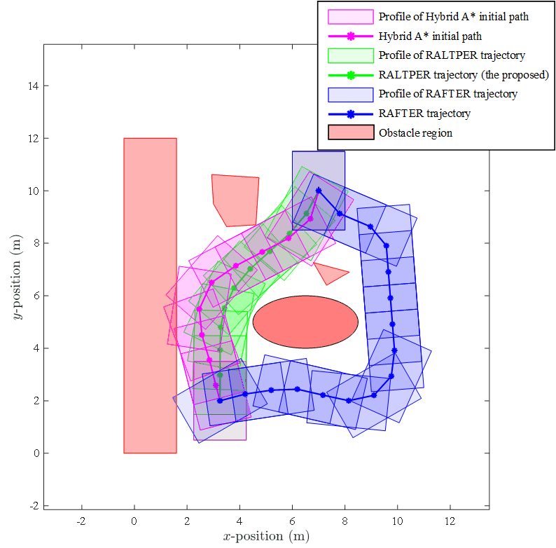
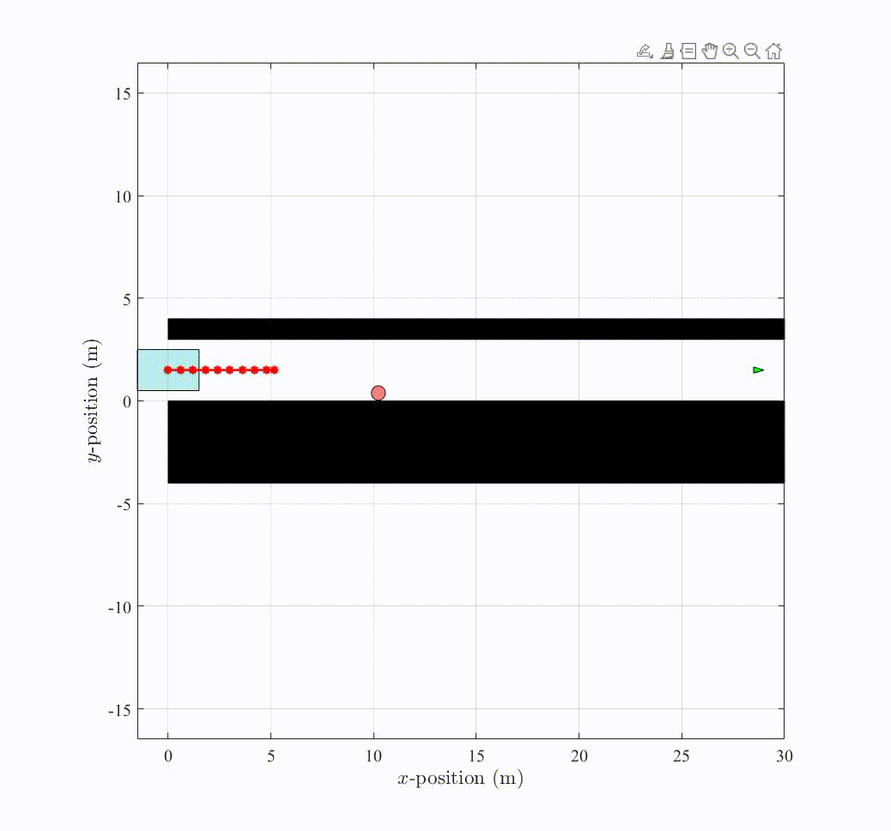

# RALTPER
## 1 Introduce
RALTPER: A Risk-Aware Local Trajectory Planner for Complex Environment with Gaussian Uncertainty

This repository provides the Matlab code for case 2 in the experiment

**Incomplete:** C++code is currently being organized

## 2 Prerequisites
1 MATLAB

2 CasADi environment

3 MATLAB/Navigation Toolbox/Motion Planning

## 3 Experiment

### Case1 Complex, Static, Mixed Environment
Three convex polygonal obstacles were placed, a rectangle, a triangle, and a pentagon, as well as an elliptical obstacle.

### Case2 Narrow Single-Lane Pedestrian Avoidance
The scenario considered is a narrow one-way lane, analogous to an old parking lot environment, with a moving pedestrian in the lane.

The lane is 3 meters wide, and the vehicle is 2 meters wide and 3 meters long. The pedestrian is represented by a disk with a radius of 0.3 meters. 

The simulation is set up such that the vehicle is driving in the center of the lane, needs to overtake the pedestrian, and reach the goal point. 

